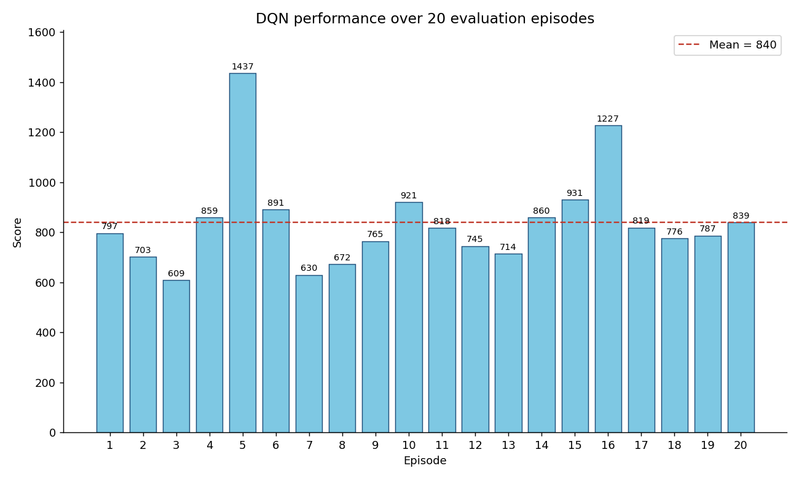
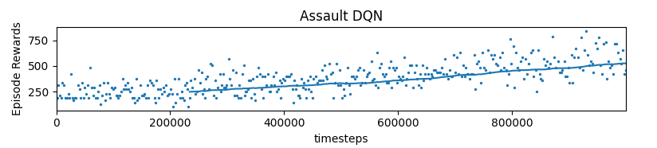
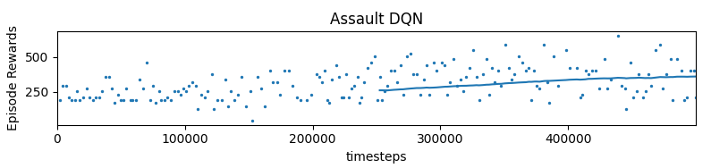
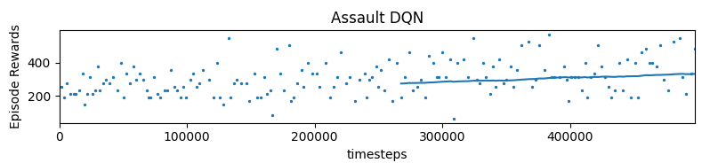
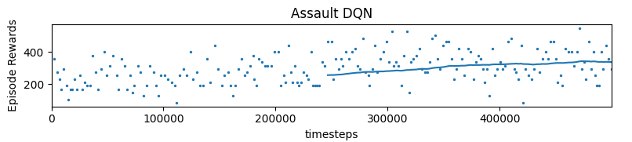
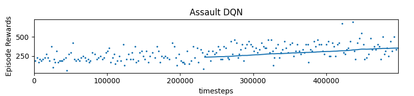
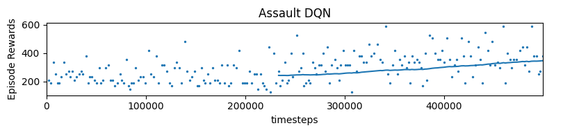

# Deep Q-Network on Atari *Assault*


> **Academic project** — This repository was developed as part of the Reinforcement Learning course at [Université Paris Dauphine – PSL](https://www.dauphine.psl.eu/) during the 2025-2026 academic year. The goal was to apply deep reinforcement learning concepts covered in class to a concrete problem: training an agent to play an Atari game from raw pixels, from algorithm selection and hyperparameter search through to evaluation.

A reinforcement-learning agent that learns to play the Atari 2600 game
**Assault** from raw pixels, using a **Deep Q-Network (DQN)** trained with
[Stable-Baselines3](https://stable-baselines3.readthedocs.io/).

<p align="center">
  
</p>

---

## Overview

In *Assault*, the player controls a ship anchored at the bottom of the screen.
A mother-ship at the top continuously deploys smaller enemies and fires at the
player. The agent must **dodge incoming fire while destroying the deployed
enemies**, which requires anticipating projectile trajectories — a good fit for
a learning-based controller.

The agent observes only the game screen (a stack of pixel frames) and chooses
among the 7 discrete actions of the environment. It is trained end-to-end with
DQN: a convolutional network estimates the action-values *Q(s, a)*, and the
greedy action is taken at evaluation time.

## Why DQN?

The choice of algorithm follows directly from the structure of the problem:

- **Pixel observations.** The state is an image, not a compact vector of
  coordinates. A tabular Q-learning approach is infeasible because the number
  of possible pixel combinations is astronomically large. DQN replaces the
  Q-table with a convolutional neural network that generalises across visually
  similar states.
- **Small discrete action space.** With only 7 actions, the network can output
  one Q-value per action and simply pick the maximum — exactly the setting DQN
  is designed for.
- **Correlated consecutive frames.** Successive frames are nearly identical, so
  training online on consecutive transitions biases the agent and causes it to
  forget. DQN's **experience replay** buffer stores past transitions and trains
  on random mini-batches, breaking the temporal correlation.

## Environment

| Property            | Value                                                        |
|---------------------|--------------------------------------------------------------|
| Environment id      | `ALE/Assault-v5`                                             |
| Observation         | 4 stacked grayscale frames, 84×84 pixels                     |
| Action space        | Discrete (7 actions)                                         |
| Preprocessing       | `AtariWrapper`: no-op reset, fire-on-reset, 4-frame skip + max-pool, grayscale, 84×84 resize |
| Training wrapper     | Reward clipping + episodic life (`terminal_on_life_loss=True`) |
| Evaluation wrapper   | Raw score, full episodes (`clip_reward=False`, `terminal_on_life_loss=False`) |

The preprocessing pipeline is defined once in [`src/env.py`](src/env.py) and
shared by both the training and the evaluation scripts.

## Results

The final agent was trained for **1,000,000 timesteps**. Episode rewards climb
steadily over training, reaching roughly 500 on average with peaks near 800 by
the end:

<p align="center">
  
</p>

Evaluated over **20 full games** with a deterministic policy, the agent reaches
the following scores:

| Metric  | Value |
|---------|-------|
| Mean    | 840   |
| Median  | 807.5 |
| Std     | 188.3 |
| Min     | 609   |
| Max     | 1437  |

The agent reliably survives and clears enemies, with several games well above
1,200 points. The score chart above (`assets/evaluation_scores.png`) is produced
directly by the evaluation script.

> Reproduce the evaluation chart:
> ```bash
> python src/evaluate.py --plot assets/evaluation_scores.png
> ```

## Project structure

```
RL-Project/
├── README.md
├── requirements.txt
├── .gitignore
├── assets/                  # Figures used in this README
│   ├── training_curve.png
│   ├── evaluation_scores.png
│   └── ...                  # hyperparameter-search figures
├── models/
│   └── DQN_assault.zip      # Trained agent (1M timesteps)
└── src/
    ├── env.py               # Shared environment factory
    ├── train.py             # Training entry point
    └── evaluate.py          # Evaluation entry point
```

## Hyperparameters

The final configuration (stored in `models/DQN_assault.zip`):

| Hyperparameter           | Value     |
|--------------------------|-----------|
| Policy                   | `CnnPolicy` (Nature CNN) |
| Total timesteps          | 1,000,000 |
| Replay buffer size       | 50,000    |
| Learning rate            | 1e-4      |
| Batch size               | 32        |
| Discount factor (γ)      | 0.99      |
| Exploration fraction     | 0.1       |
| Final exploration ε      | 0.01      |
| Target update interval   | 10,000    |
| Frame stack              | 4         |

## Methodology: hyperparameter search

Candidate values were compared at 500,000 timesteps (a full run is expensive)
before committing to the 1,000,000-timestep final training.

### Learning rate

Three learning rates were compared. `1e-3` and `1e-4` clearly outperformed
`1e-5`; since the two best were close, **`1e-4`** was selected as the more
stable choice.

| `1e-3` | `1e-4` | `1e-5` |
|:------:|:------:|:------:|
|  |  |  |

### Replay buffer size

Buffer sizes between 30,000 and 50,000 produced no meaningful difference, so
the larger **50,000** was kept.

### Exploration fraction

Values of 0.05, 0.1 and 0.2 were compared. **0.1** gave the best learning
behaviour and was selected.

| `0.05` | `0.1` | `0.2` |
|:------:|:-----:|:-----:|
|  |  |  |

## Limitations & future work

- The agent was trained for only 1M timesteps; the reward curve is still rising
  at the end, so more training would likely improve performance further. The
  main constraint was compute time and GPU availability.
- Natural extensions include longer training, **Double DQN**, **Dueling DQN**,
  **Prioritized Experience Replay**, or a distributional / Rainbow variant.
- Running several seeds would give confidence intervals rather than a single
  point estimate.
